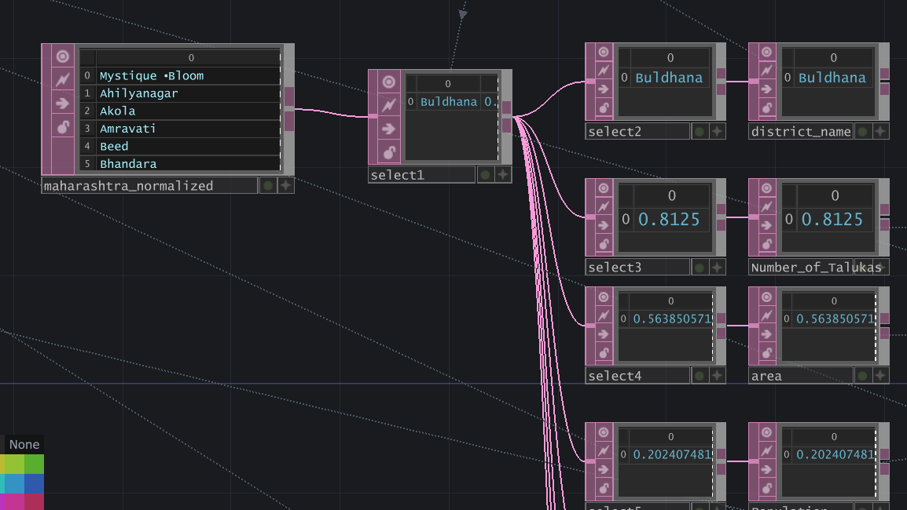

. ݁₊ ⊹ . ݁ ⟡ ݁ . ⊹ ₊ ݁.
# Mystique Bloom - Data Visualization using Touchdesigner

This project transforms socio-economic data from Maharashtra's districts into tree-like structures. Each district grows as a living form. Metrics from India's 2011 Census (via Kaggle) drive the morphology: population thickens the trunk, density shapes the petals, literacy adds a glowing aura, area determines the thickness of the branch and sex ratio, the crookedness of it. Quantitative values get normalized, then mapped to L-system rules for procedural generation. The result is a way of seeing data not as tables, but as living forms, where even inequality manifests in tangible, physical form. <br><br>


## Required Software
1. **TouchDesigner (Free)** - [https://derivative.ca/download](https://derivative.ca/download)  
*Non-commercial license works perfectly.*<br>
2. **Excel**   <br>


## File Structure 📁 

```
├── Dataset/
│ ├── maharashtra-districts.csv 
│ ├── maharashtra-districts_normalised.csv
│ └── maharashtra-districts_normalised_Display.csv
├── imgs/
│ └── img_gif.gif (for README only)
├── MystiqueBloom_DataViz_Lsystem.toe
├── LICENSE
└── README.md
```

| File | Description |
| --- | --- |
| `maharashtra-districts.csv` | Official dataset from Kaggle |
| `maharashtra-districts_normalised` | Edited dataset, with the qualitative data normalised |
| `maharashtra-districts_normalised_Display` | For display purpose in this project |
| `img_gif.gif` | For REAME.md file purpose only |
| `MystiqueBloom_DataViz_Lsystem.toe` | Main TD file |

<br>

## Getting Started °❀⋆.ೃ࿔*:･
>**IMPORTANT**
>- Download these ``.csv`` files in your system: ``'maharashtra-districts_normalised'``, ``'maharashtra-districts_normalised_Display'``
1. Download the project files and open ``MystiqueBloom_DataViz_Lsystem.toe``.
2. Drag and drop both the .csv files in the project.
3. Connect them to the correct ``'select'`` nodes. (see the images below)
4. Viola, you just grew a district as a tree-form !

       

<br>


## References 📑
### Data Source:
- Maharashtra Districts by Tushar Kute: [Kaggle](https://www.kaggle.com/datasets/tusharkute/maharashtra-districts)

### YT Tutorials  
- Interactive Flower in TouchDesigner: L-systems, Modeling Plants and MediaPipe by PeiPei: [❀࿐](https://youtu.be/KGALeCnTTbg?si=POVCow5E9k_t04lf)
- L-Systems & Particles | TouchDesigner Tutorial: L-systems, Modeling Plants and MediaPipe by anya maryina: [❀࿐](https://youtu.be/LuLpaUpCaek?si=mv1xHvQVmkPIY_H3) 
- L Systems : Creating Plants from Simple Rules - Computerphile: [❀࿐](https://youtu.be/puwhf-404Xc?si=AFF6JqvLj6YeqEMu)  
- Working with DATs - TouchDesigner Tutorial: Beginner Crash Course: [❀࿐](https://youtu.be/wsK_ur6OqTg?si=Cylomd-agUnMxAWZ)
<br><br>

**･ﾟ࿔*:࿔*:･ﾟ࿐ ࿔*:･ﾟ⋆.ೃ࿔*:･ ✿✧˖°. ༄࿐ ࿔*:･ﾟ࿐ ࿔*:･ﾟ**<br>
## View Demo

🔗 Behance: [](https://www.behance.net/gallery/245768719/Mystique-Bloom-Data-Vizualization) <br>
🔗 Instagram: []([https://your-link-here.com](https://instagram.com/oad.ris/)) <br>
🔗 Instagram: []([https://your-link-here.com](https://instagram.com/oad.ris/))<br>
<br>
**･ﾟ࿔*:࿔*:･ﾟ࿐ ࿔*:･ﾟ⋆.ೃ࿔*:･ ✿✧˖°. ༄࿐ ࿔*:･ﾟ࿐ ࿔*:･ﾟ**<br><br>


### License
This project is licensed under the [MIT License](LICENSE).
